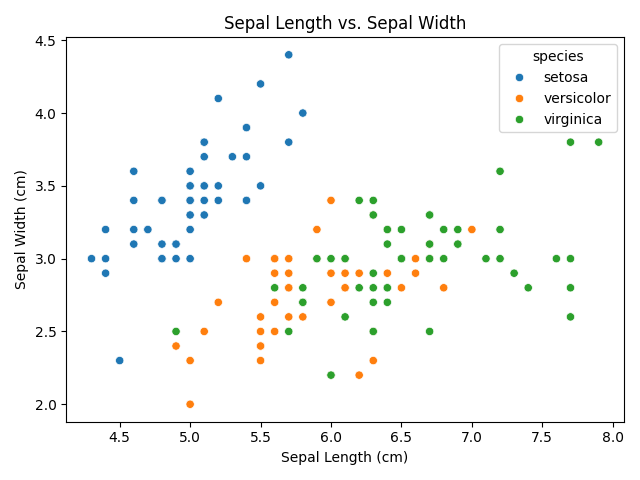

# Iris Dataset - Exploratory Data Analysis & Visualization

This project involves basic **Exploratory Data Analysis (EDA)** and **data visualization** using the famous **Iris dataset**.  
The goal is to understand the distribution, relationships, and patterns within the data using various plots.

---

## Files Included

- `Iris_EDA.ipynb` — Jupyter notebook with all the code and visualizations
- `iris_barplot.png` — Bar chart showing count of each species
- `iris_linechart.png` — Line plot showing sepal length trends
- `iris_scatterplot.png` — Scatter plot comparing sepal length vs width
- (Optional) `iris_pairplot.png` — All pairwise relationships between features

---

## What I Did

- Loaded the Iris dataset using Seaborn
- Visualized:
  - Bar Plot → species distribution
  - Line Chart → sepal length over samples
  - Scatter Plot → relationship between sepal length & width
  - Pairplot → multi-feature relationships (optional)
- Saved each plot as a PNG for reporting

---

## Tools Used

- **Python**
- **Google Colab**
- **Pandas**
- **Matplotlib**
- **Seaborn**

---

## Sample Visuals

Bar Plot | Scatter Plot
:--:|:--:
 | 

---

## How to Run This Project

1. Clone or download this repository
2. Open `Iris_EDA.ipynb` in Jupyter Notebook or Google Colab
3. Run each cell to generate plots and save them

---

## About Me

I'm currently learning data analysis step by step and this project is part of my practice with basic EDA and visualizations.  
Always open to feedback, suggestions, and learning opportunities!

---

## Keywords

`#Python` `#EDA` `#IrisDataset` `#DataVisualization` `#Seaborn` `#Matplotlib` `#BeginnerProject`
